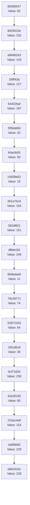

# Hash Chain Visualization

```mermaid
graph TD
    C0["e8b242dc<br/>Value: 228"]
    C1["3af98665<br/>Value: 229"]
    C1 --> C0
    C2["210a14e8<br/>Value: 154"]
    C2 --> C1
    C3["42e26165<br/>Value: 60"]
    C3 --> C2
    C4["0cf71834<br/>Value: 238"]
    C4 --> C3
    C5["1f01d819<br/>Value: 36"]
    C5 --> C4
    C6["52871043<br/>Value: 64"]
    C6 --> C5
    C7["79c29771<br/>Value: 74"]
    C7 --> C6
    C8["8b9adae6<br/>Value: 11"]
    C8 --> C7
    C9["dfbfe434<br/>Value: 246"]
    C9 --> C8
    C10["262df821<br/>Value: 151"]
    C10 --> C9
    C11["d01e7bc9<br/>Value: 154"]
    C11 --> C10
    C12["c5939e52<br/>Value: 15"]
    C12 --> C11
    C13["64acfe55<br/>Value: 50"]
    C13 --> C12
    C14["5f5bdd0d<br/>Value: 42"]
    C14 --> C13
    C15["64422baf<br/>Value: 187"]
    C15 --> C14
    C16["1f6ff43a<br/>Value: 127"]
    C16 --> C15
    C17["a94662e3<br/>Value: 143"]
    C17 --> C16
    C18["8029523e<br/>Value: 232"]
    C18 --> C17
    C19["80306547<br/>Value: 82"]
    C19 --> C18
```