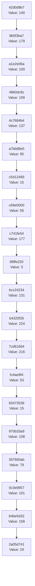

# Hash Chain Visualization

```mermaid
graph TD
    C0["2a05d741<br/>Value: 29"]
    C1["b4be5d32<br/>Value: 158"]
    C1 --> C0
    C2["0c3e9957<br/>Value: 101"]
    C2 --> C1
    C3["357660ab<br/>Value: 79"]
    C3 --> C2
    C4["970b33a9<br/>Value: 108"]
    C4 --> C3
    C5["93473536<br/>Value: 15"]
    C5 --> C4
    C6["fc4ae9f4<br/>Value: 53"]
    C6 --> C5
    C7["7cd61664<br/>Value: 216"]
    C7 --> C6
    C8["b4320f26<br/>Value: 224"]
    C8 --> C7
    C9["bcc24234<br/>Value: 131"]
    C9 --> C8
    C10["88ffe220<br/>Value: 3"]
    C10 --> C9
    C11["c741fe54<br/>Value: 177"]
    C11 --> C10
    C12["c69e0000<br/>Value: 56"]
    C12 --> C11
    C13["c5d12489<br/>Value: 15"]
    C13 --> C12
    C14["a7bb88e5<br/>Value: 95"]
    C14 --> C13
    C15["4c7684b4<br/>Value: 137"]
    C15 --> C14
    C16["4860dc9c<br/>Value: 109"]
    C16 --> C15
    C17["a1e2e06a<br/>Value: 100"]
    C17 --> C16
    C18["9b5f3ba7<br/>Value: 179"]
    C18 --> C17
    C19["42d0d9b7<br/>Value: 140"]
    C19 --> C18
```