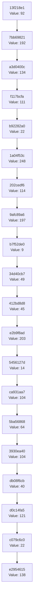

# Hash Chain Visualization

```mermaid
graph TD
    C0["e2954615<br/>Value: 138"]
    C1["c079c6c0<br/>Value: 22"]
    C1 --> C0
    C2["d0c14fa5<br/>Value: 121"]
    C2 --> C1
    C3["db08f6cb<br/>Value: 40"]
    C3 --> C2
    C4["3930ea40<br/>Value: 104"]
    C4 --> C3
    C5["5ba56868<br/>Value: 64"]
    C5 --> C4
    C6["ca931aa7<br/>Value: 104"]
    C6 --> C5
    C7["5456127d<br/>Value: 14"]
    C7 --> C6
    C8["e2b9f8ad<br/>Value: 203"]
    C8 --> C7
    C9["412bd8d8<br/>Value: 45"]
    C9 --> C8
    C10["34d40cb7<br/>Value: 49"]
    C10 --> C9
    C11["b7f52de0<br/>Value: 9"]
    C11 --> C10
    C12["9afc89a6<br/>Value: 197"]
    C12 --> C11
    C13["202cedf6<br/>Value: 114"]
    C13 --> C12
    C14["1a04f53c<br/>Value: 248"]
    C14 --> C13
    C15["b92282a0<br/>Value: 22"]
    C15 --> C14
    C16["f117bcfa<br/>Value: 111"]
    C16 --> C15
    C17["a3d0400c<br/>Value: 134"]
    C17 --> C16
    C18["7bb69821<br/>Value: 192"]
    C18 --> C17
    C19["13f218e1<br/>Value: 92"]
    C19 --> C18
```