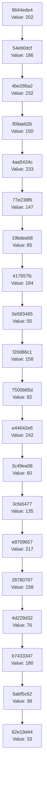

# Hash Chain Visualization

```mermaid
graph TD
    C0["62e19d44<br/>Value: 33"]
    C1["5abf5c62<br/>Value: 38"]
    C1 --> C0
    C2["b7433347<br/>Value: 180"]
    C2 --> C1
    C3["4d229d32<br/>Value: 76"]
    C3 --> C2
    C4["28780767<br/>Value: 158"]
    C4 --> C3
    C5["e8709657<br/>Value: 217"]
    C5 --> C4
    C6["3cfa5477<br/>Value: 135"]
    C6 --> C5
    C7["3c49ea08<br/>Value: 60"]
    C7 --> C6
    C8["e44642e6<br/>Value: 242"]
    C8 --> C7
    C9["7500b65d<br/>Value: 82"]
    C9 --> C8
    C10["f20d86c1<br/>Value: 158"]
    C10 --> C9
    C11["0e583465<br/>Value: 55"]
    C11 --> C10
    C12["417657fc<br/>Value: 184"]
    C12 --> C11
    C13["19bdeeb8<br/>Value: 85"]
    C13 --> C12
    C14["77e238f6<br/>Value: 147"]
    C14 --> C13
    C15["4aa5434c<br/>Value: 233"]
    C15 --> C14
    C16["f09ae62b<br/>Value: 150"]
    C16 --> C15
    C17["4be286a2<br/>Value: 232"]
    C17 --> C16
    C18["54eb0dcf<br/>Value: 186"]
    C18 --> C17
    C19["9644ede4<br/>Value: 202"]
    C19 --> C18
```