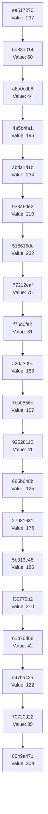

# Hash Chain Visualization

```mermaid
graph TD
    C0["8049a471<br/>Value: 209"]
    C1["70720d22<br/>Value: 35"]
    C1 --> C0
    C2["c47ba42a<br/>Value: 122"]
    C2 --> C1
    C3["61876d68<br/>Value: 42"]
    C3 --> C2
    C4["f30779b2<br/>Value: 210"]
    C4 --> C3
    C5["5b313e48<br/>Value: 186"]
    C5 --> C4
    C6["27981681<br/>Value: 176"]
    C6 --> C5
    C7["685b648b<br/>Value: 125"]
    C7 --> C6
    C8["92628110<br/>Value: 41"]
    C8 --> C7
    C9["7cb0556b<br/>Value: 157"]
    C9 --> C8
    C10["a2da309d<br/>Value: 183"]
    C10 --> C9
    C11["f75d0fe2<br/>Value: 81"]
    C11 --> C10
    C12["77212eaf<br/>Value: 75"]
    C12 --> C11
    C13["518615dc<br/>Value: 232"]
    C13 --> C12
    C14["938a6de2<br/>Value: 210"]
    C14 --> C13
    C15["3bda1d1b<br/>Value: 234"]
    C15 --> C14
    C16["4a5b4fa1<br/>Value: 195"]
    C16 --> C15
    C17["a6a0cdb8<br/>Value: 44"]
    C17 --> C16
    C18["6d83a014<br/>Value: 50"]
    C18 --> C17
    C19["ea517270<br/>Value: 237"]
    C19 --> C18
```