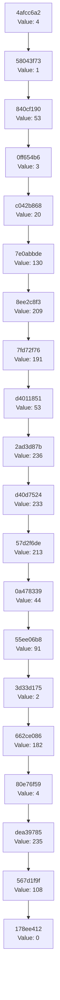

# Hash Chain Visualization

```mermaid
graph TD
    C0["178ee412<br/>Value: 0"]
    C1["567d1f9f<br/>Value: 108"]
    C1 --> C0
    C2["dea39785<br/>Value: 235"]
    C2 --> C1
    C3["80e76f59<br/>Value: 4"]
    C3 --> C2
    C4["662ce086<br/>Value: 182"]
    C4 --> C3
    C5["3d33d175<br/>Value: 2"]
    C5 --> C4
    C6["55ee06b8<br/>Value: 91"]
    C6 --> C5
    C7["0a478339<br/>Value: 44"]
    C7 --> C6
    C8["57d2f6de<br/>Value: 213"]
    C8 --> C7
    C9["d40d7524<br/>Value: 233"]
    C9 --> C8
    C10["2ad3d87b<br/>Value: 236"]
    C10 --> C9
    C11["d4011851<br/>Value: 53"]
    C11 --> C10
    C12["7fd72f76<br/>Value: 191"]
    C12 --> C11
    C13["8ee2c8f3<br/>Value: 209"]
    C13 --> C12
    C14["7e0abbde<br/>Value: 130"]
    C14 --> C13
    C15["c042b868<br/>Value: 20"]
    C15 --> C14
    C16["0ff654b6<br/>Value: 3"]
    C16 --> C15
    C17["840cf190<br/>Value: 53"]
    C17 --> C16
    C18["58043f73<br/>Value: 1"]
    C18 --> C17
    C19["4afcc6a2<br/>Value: 4"]
    C19 --> C18
```