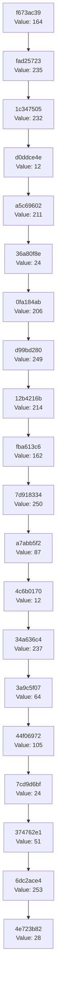

# Hash Chain Visualization

```mermaid
graph TD
    C0["4e723b82<br/>Value: 28"]
    C1["6dc2ace4<br/>Value: 253"]
    C1 --> C0
    C2["374762e1<br/>Value: 51"]
    C2 --> C1
    C3["7cd9d6bf<br/>Value: 24"]
    C3 --> C2
    C4["44f06972<br/>Value: 105"]
    C4 --> C3
    C5["3a9c5f07<br/>Value: 64"]
    C5 --> C4
    C6["34a636c4<br/>Value: 237"]
    C6 --> C5
    C7["4c6b0170<br/>Value: 12"]
    C7 --> C6
    C8["a7abb5f2<br/>Value: 87"]
    C8 --> C7
    C9["7d918334<br/>Value: 250"]
    C9 --> C8
    C10["fba613c6<br/>Value: 162"]
    C10 --> C9
    C11["12b4216b<br/>Value: 214"]
    C11 --> C10
    C12["d99bd280<br/>Value: 249"]
    C12 --> C11
    C13["0fa184ab<br/>Value: 206"]
    C13 --> C12
    C14["36a80f8e<br/>Value: 24"]
    C14 --> C13
    C15["a5c69602<br/>Value: 211"]
    C15 --> C14
    C16["d0ddce4e<br/>Value: 12"]
    C16 --> C15
    C17["1c347505<br/>Value: 232"]
    C17 --> C16
    C18["fad25723<br/>Value: 235"]
    C18 --> C17
    C19["f673ac39<br/>Value: 164"]
    C19 --> C18
```