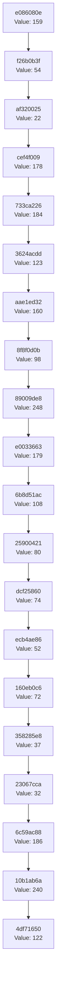

# Hash Chain Visualization

```mermaid
graph TD
    C0["4df71650<br/>Value: 122"]
    C1["10b1ab6a<br/>Value: 240"]
    C1 --> C0
    C2["6c59ac88<br/>Value: 186"]
    C2 --> C1
    C3["23067cca<br/>Value: 32"]
    C3 --> C2
    C4["358285e8<br/>Value: 37"]
    C4 --> C3
    C5["160eb0c6<br/>Value: 72"]
    C5 --> C4
    C6["ecb4ae86<br/>Value: 52"]
    C6 --> C5
    C7["dcf25860<br/>Value: 74"]
    C7 --> C6
    C8["25900421<br/>Value: 80"]
    C8 --> C7
    C9["6b8d51ac<br/>Value: 108"]
    C9 --> C8
    C10["e0033663<br/>Value: 179"]
    C10 --> C9
    C11["89009de8<br/>Value: 248"]
    C11 --> C10
    C12["8f8f0d0b<br/>Value: 98"]
    C12 --> C11
    C13["aae1ed32<br/>Value: 160"]
    C13 --> C12
    C14["3624acdd<br/>Value: 123"]
    C14 --> C13
    C15["733ca226<br/>Value: 184"]
    C15 --> C14
    C16["cef4f009<br/>Value: 178"]
    C16 --> C15
    C17["af320025<br/>Value: 22"]
    C17 --> C16
    C18["f26b0b3f<br/>Value: 54"]
    C18 --> C17
    C19["e086080e<br/>Value: 159"]
    C19 --> C18
```