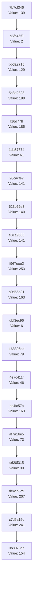

# Hash Chain Visualization

```mermaid
graph TD
    C0["0b8073dc<br/>Value: 154"]
    C1["c7d5a15c<br/>Value: 241"]
    C1 --> C0
    C2["de4cb8c9<br/>Value: 207"]
    C2 --> C1
    C3["c620f315<br/>Value: 39"]
    C3 --> C2
    C4["af7a16e5<br/>Value: 73"]
    C4 --> C3
    C5["bc4fc57c<br/>Value: 163"]
    C5 --> C4
    C6["4e7c411f<br/>Value: 46"]
    C6 --> C5
    C7["168896dd<br/>Value: 79"]
    C7 --> C6
    C8["dbf3ec96<br/>Value: 6"]
    C8 --> C7
    C9["a0d55e31<br/>Value: 163"]
    C9 --> C8
    C10["f967eee2<br/>Value: 253"]
    C10 --> C9
    C11["e31a9833<br/>Value: 141"]
    C11 --> C10
    C12["623b62e3<br/>Value: 140"]
    C12 --> C11
    C13["20cacfe7<br/>Value: 141"]
    C13 --> C12
    C14["1da57374<br/>Value: 61"]
    C14 --> C13
    C15["f16d77ff<br/>Value: 185"]
    C15 --> C14
    C16["5a3d2323<br/>Value: 198"]
    C16 --> C15
    C17["bbda2715<br/>Value: 129"]
    C17 --> C16
    C18["a5fb46f0<br/>Value: 2"]
    C18 --> C17
    C19["7b7cf346<br/>Value: 139"]
    C19 --> C18
```