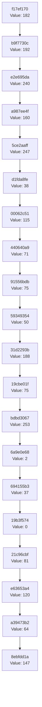

# Hash Chain Visualization

```mermaid
graph TD
    C0["8ebfdd1a<br/>Value: 147"]
    C1["a39473b2<br/>Value: 64"]
    C1 --> C0
    C2["e63653a4<br/>Value: 120"]
    C2 --> C1
    C3["21c96cbf<br/>Value: 81"]
    C3 --> C2
    C4["19b3f574<br/>Value: 0"]
    C4 --> C3
    C5["694155b3<br/>Value: 37"]
    C5 --> C4
    C6["6a9e0e68<br/>Value: 2"]
    C6 --> C5
    C7["bdbd3067<br/>Value: 253"]
    C7 --> C6
    C8["19cbe01f<br/>Value: 75"]
    C8 --> C7
    C9["31d2293b<br/>Value: 188"]
    C9 --> C8
    C10["59349354<br/>Value: 50"]
    C10 --> C9
    C11["91556bdb<br/>Value: 75"]
    C11 --> C10
    C12["440640a9<br/>Value: 71"]
    C12 --> C11
    C13["00062c51<br/>Value: 115"]
    C13 --> C12
    C14["d1fda8fe<br/>Value: 38"]
    C14 --> C13
    C15["5ce2aaff<br/>Value: 247"]
    C15 --> C14
    C16["a987ee4f<br/>Value: 160"]
    C16 --> C15
    C17["e2e695da<br/>Value: 240"]
    C17 --> C16
    C18["b9f7730c<br/>Value: 192"]
    C18 --> C17
    C19["f17ef170<br/>Value: 182"]
    C19 --> C18
```