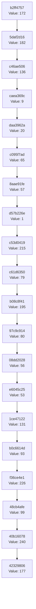

# Hash Chain Visualization

```mermaid
graph TD
    C0["42329806<br/>Value: 177"]
    C1["40b16078<br/>Value: 240"]
    C1 --> C0
    C2["48cb4afe<br/>Value: 99"]
    C2 --> C1
    C3["f36ce4e1<br/>Value: 226"]
    C3 --> C2
    C4["b0c6614d<br/>Value: 93"]
    C4 --> C3
    C5["1ce47122<br/>Value: 131"]
    C5 --> C4
    C6["e6045c25<br/>Value: 53"]
    C6 --> C5
    C7["08dd2028<br/>Value: 56"]
    C7 --> C6
    C8["97c9c914<br/>Value: 80"]
    C8 --> C7
    C9["b08c8f41<br/>Value: 195"]
    C9 --> C8
    C10["c61d6350<br/>Value: 79"]
    C10 --> C9
    C11["c53d0419<br/>Value: 215"]
    C11 --> C10
    C12["d57b226e<br/>Value: 1"]
    C12 --> C11
    C13["8aae91fe<br/>Value: 57"]
    C13 --> C12
    C14["c095f7ad<br/>Value: 65"]
    C14 --> C13
    C15["daa3962a<br/>Value: 20"]
    C15 --> C14
    C16["caea369c<br/>Value: 9"]
    C16 --> C15
    C17["c46ae506<br/>Value: 136"]
    C17 --> C16
    C18["5daf2d16<br/>Value: 182"]
    C18 --> C17
    C19["b2ff4757<br/>Value: 172"]
    C19 --> C18
```