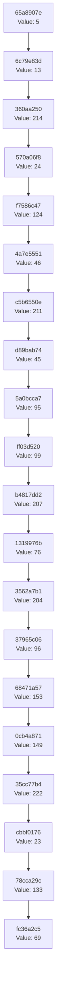

# Hash Chain Visualization

```mermaid
graph TD
    C0["fc36a2c5<br/>Value: 69"]
    C1["78cca29c<br/>Value: 133"]
    C1 --> C0
    C2["cbbf0176<br/>Value: 23"]
    C2 --> C1
    C3["35cc77b4<br/>Value: 222"]
    C3 --> C2
    C4["0cb4a871<br/>Value: 149"]
    C4 --> C3
    C5["68471a57<br/>Value: 153"]
    C5 --> C4
    C6["37965c06<br/>Value: 96"]
    C6 --> C5
    C7["3562a7b1<br/>Value: 204"]
    C7 --> C6
    C8["1319976b<br/>Value: 76"]
    C8 --> C7
    C9["b4817dd2<br/>Value: 207"]
    C9 --> C8
    C10["ff03d520<br/>Value: 99"]
    C10 --> C9
    C11["5a0bcca7<br/>Value: 95"]
    C11 --> C10
    C12["d89bab74<br/>Value: 45"]
    C12 --> C11
    C13["c5b6550e<br/>Value: 211"]
    C13 --> C12
    C14["4a7e5551<br/>Value: 46"]
    C14 --> C13
    C15["f7586c47<br/>Value: 124"]
    C15 --> C14
    C16["570a06f8<br/>Value: 24"]
    C16 --> C15
    C17["360aa250<br/>Value: 214"]
    C17 --> C16
    C18["6c79e83d<br/>Value: 13"]
    C18 --> C17
    C19["65a8907e<br/>Value: 5"]
    C19 --> C18
```