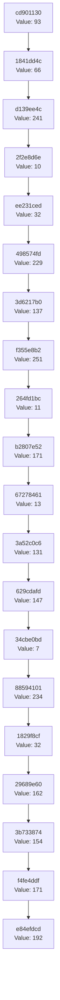

# Hash Chain Visualization

```mermaid
graph TD
    C0["e84efdcd<br/>Value: 192"]
    C1["f4fe4ddf<br/>Value: 171"]
    C1 --> C0
    C2["3b733874<br/>Value: 154"]
    C2 --> C1
    C3["29689e60<br/>Value: 162"]
    C3 --> C2
    C4["1829f8cf<br/>Value: 32"]
    C4 --> C3
    C5["88594101<br/>Value: 234"]
    C5 --> C4
    C6["34cbe0bd<br/>Value: 7"]
    C6 --> C5
    C7["629cdafd<br/>Value: 147"]
    C7 --> C6
    C8["3a52c0c6<br/>Value: 131"]
    C8 --> C7
    C9["67278461<br/>Value: 13"]
    C9 --> C8
    C10["b2807e52<br/>Value: 171"]
    C10 --> C9
    C11["264fd1bc<br/>Value: 11"]
    C11 --> C10
    C12["f355e8b2<br/>Value: 251"]
    C12 --> C11
    C13["3d6217b0<br/>Value: 137"]
    C13 --> C12
    C14["498574fd<br/>Value: 229"]
    C14 --> C13
    C15["ee231ced<br/>Value: 32"]
    C15 --> C14
    C16["2f2e8d6e<br/>Value: 10"]
    C16 --> C15
    C17["d139ee4c<br/>Value: 241"]
    C17 --> C16
    C18["1841dd4c<br/>Value: 66"]
    C18 --> C17
    C19["cd901130<br/>Value: 93"]
    C19 --> C18
```