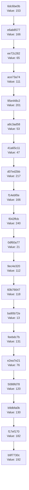

# Hash Chain Visualization

```mermaid
graph TD
    C0["b9f7730c<br/>Value: 192"]
    C1["f17ef170<br/>Value: 182"]
    C1 --> C0
    C2["b9dbfa0b<br/>Value: 130"]
    C2 --> C1
    C3["5088fd78<br/>Value: 120"]
    C3 --> C2
    C4["e2ea7e21<br/>Value: 76"]
    C4 --> C3
    C5["feebdc7b<br/>Value: 131"]
    C5 --> C4
    C6["ba90b72e<br/>Value: 13"]
    C6 --> C5
    C7["60b76647<br/>Value: 118"]
    C7 --> C6
    C8["9ec4e320<br/>Value: 112"]
    C8 --> C7
    C9["0df60a77<br/>Value: 21"]
    C9 --> C8
    C10["f042ffcb<br/>Value: 240"]
    C10 --> C9
    C11["f14ebf0e<br/>Value: 166"]
    C11 --> C10
    C12["d07ed2bb<br/>Value: 217"]
    C12 --> C11
    C13["41a65c11<br/>Value: 47"]
    C13 --> C12
    C14["a8c3ad58<br/>Value: 53"]
    C14 --> C13
    C15["95e448c2<br/>Value: 201"]
    C15 --> C14
    C16["ace73a74<br/>Value: 111"]
    C16 --> C15
    C17["ee72c282<br/>Value: 65"]
    C17 --> C16
    C18["e6ab8577<br/>Value: 166"]
    C18 --> C17
    C19["6dc6be0b<br/>Value: 153"]
    C19 --> C18
```