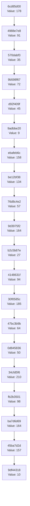

# Hash Chain Visualization

```mermaid
graph TD
    C0["9df44318<br/>Value: 10"]
    C1["45ba7d2d<br/>Value: 157"]
    C1 --> C0
    C2["ba7d6d69<br/>Value: 164"]
    C2 --> C1
    C3["fb2b3501<br/>Value: 98"]
    C3 --> C2
    C4["34cfd5f6<br/>Value: 210"]
    C4 --> C3
    C5["0d845836<br/>Value: 50"]
    C5 --> C4
    C6["47bc3b9b<br/>Value: 64"]
    C6 --> C5
    C7["30f0585c<br/>Value: 185"]
    C7 --> C6
    C8["4148631f<br/>Value: 94"]
    C8 --> C7
    C9["b2c5b87e<br/>Value: 27"]
    C9 --> C8
    C10["9d3975f2<br/>Value: 164"]
    C10 --> C9
    C11["76d8c4e2<br/>Value: 57"]
    C11 --> C10
    C12["be12bf38<br/>Value: 134"]
    C12 --> C11
    C13["ebafeb6c<br/>Value: 158"]
    C13 --> C12
    C14["9adbbe20<br/>Value: 9"]
    C14 --> C13
    C15["d92f409f<br/>Value: 45"]
    C15 --> C14
    C16["9b598f67<br/>Value: 72"]
    C16 --> C15
    C17["570dabf3<br/>Value: 35"]
    C17 --> C16
    C18["4988e7e8<br/>Value: 91"]
    C18 --> C17
    C19["6cd85d00<br/>Value: 178"]
    C19 --> C18
```