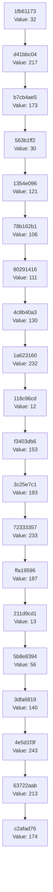

# Hash Chain Visualization

```mermaid
graph TD
    C0["c2afad76<br/>Value: 174"]
    C1["63722aab<br/>Value: 213"]
    C1 --> C0
    C2["4e5d1f3f<br/>Value: 243"]
    C2 --> C1
    C3["3dfa6819<br/>Value: 140"]
    C3 --> C2
    C4["5b8e8394<br/>Value: 56"]
    C4 --> C3
    C5["211d9cd1<br/>Value: 13"]
    C5 --> C4
    C6["ffa19596<br/>Value: 187"]
    C6 --> C5
    C7["72333357<br/>Value: 233"]
    C7 --> C6
    C8["3c25e7c1<br/>Value: 193"]
    C8 --> C7
    C9["f3403db6<br/>Value: 153"]
    C9 --> C8
    C10["118c96cd<br/>Value: 12"]
    C10 --> C9
    C11["1a623160<br/>Value: 232"]
    C11 --> C10
    C12["4c8b40a3<br/>Value: 130"]
    C12 --> C11
    C13["80291416<br/>Value: 111"]
    C13 --> C12
    C14["78b162b1<br/>Value: 106"]
    C14 --> C13
    C15["1354e096<br/>Value: 121"]
    C15 --> C14
    C16["563b1ff2<br/>Value: 30"]
    C16 --> C15
    C17["b7cb4ae5<br/>Value: 173"]
    C17 --> C16
    C18["d41bbc04<br/>Value: 217"]
    C18 --> C17
    C19["1fb61173<br/>Value: 32"]
    C19 --> C18
```