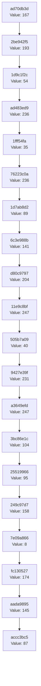

# Hash Chain Visualization

```mermaid
graph TD
    C0["accc3bc5<br/>Value: 87"]
    C1["aada9895<br/>Value: 145"]
    C1 --> C0
    C2["fc130527<br/>Value: 174"]
    C2 --> C1
    C3["7e09a866<br/>Value: 8"]
    C3 --> C2
    C4["249c97d7<br/>Value: 158"]
    C4 --> C3
    C5["25519966<br/>Value: 95"]
    C5 --> C4
    C6["3bc86e1c<br/>Value: 104"]
    C6 --> C5
    C7["a3649efd<br/>Value: 247"]
    C7 --> C6
    C8["9427e39f<br/>Value: 231"]
    C8 --> C7
    C9["505b7a09<br/>Value: 40"]
    C9 --> C8
    C10["11e9c8bf<br/>Value: 247"]
    C10 --> C9
    C11["d80c9797<br/>Value: 204"]
    C11 --> C10
    C12["6c3e988b<br/>Value: 141"]
    C12 --> C11
    C13["1d7ab8d2<br/>Value: 89"]
    C13 --> C12
    C14["76223c0a<br/>Value: 236"]
    C14 --> C13
    C15["1fff54fa<br/>Value: 35"]
    C15 --> C14
    C16["ad483ed9<br/>Value: 236"]
    C16 --> C15
    C17["1d9c1f2c<br/>Value: 54"]
    C17 --> C16
    C18["2be942f5<br/>Value: 193"]
    C18 --> C17
    C19["ad70db3d<br/>Value: 167"]
    C19 --> C18
```