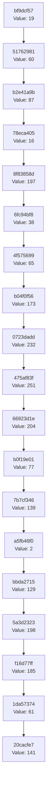

# Hash Chain Visualization

```mermaid
graph TD
    C0["20cacfe7<br/>Value: 141"]
    C1["1da57374<br/>Value: 61"]
    C1 --> C0
    C2["f16d77ff<br/>Value: 185"]
    C2 --> C1
    C3["5a3d2323<br/>Value: 198"]
    C3 --> C2
    C4["bbda2715<br/>Value: 129"]
    C4 --> C3
    C5["a5fb46f0<br/>Value: 2"]
    C5 --> C4
    C6["7b7cf346<br/>Value: 139"]
    C6 --> C5
    C7["b0f19e01<br/>Value: 77"]
    C7 --> C6
    C8["66923d1e<br/>Value: 204"]
    C8 --> C7
    C9["475af83f<br/>Value: 251"]
    C9 --> C8
    C10["0723dadd<br/>Value: 232"]
    C10 --> C9
    C11["b04f0f56<br/>Value: 173"]
    C11 --> C10
    C12["4f575699<br/>Value: 65"]
    C12 --> C11
    C13["6fc94bf8<br/>Value: 38"]
    C13 --> C12
    C14["8f83858d<br/>Value: 197"]
    C14 --> C13
    C15["78eca405<br/>Value: 16"]
    C15 --> C14
    C16["b2e41a9b<br/>Value: 87"]
    C16 --> C15
    C17["51762981<br/>Value: 60"]
    C17 --> C16
    C18["bf9dcf57<br/>Value: 19"]
    C18 --> C17
```