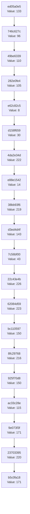

# Hash Chain Visualization

```mermaid
graph TD
    C0["b5c0fa18<br/>Value: 171"]
    C1["23703395<br/>Value: 220"]
    C1 --> C0
    C2["9e073f3f<br/>Value: 171"]
    C2 --> C1
    C3["ac33c28e<br/>Value: 115"]
    C3 --> C2
    C4["925f70d8<br/>Value: 150"]
    C4 --> C3
    C5["8fc29768<br/>Value: 216"]
    C5 --> C4
    C6["bc110597<br/>Value: 150"]
    C6 --> C5
    C7["62084d59<br/>Value: 223"]
    C7 --> C6
    C8["22c43e4b<br/>Value: 226"]
    C8 --> C7
    C9["7c56bf00<br/>Value: 43"]
    C9 --> C8
    C10["d3ed4d4f<br/>Value: 143"]
    C10 --> C9
    C11["38bb93f6<br/>Value: 219"]
    C11 --> C10
    C12["e88e1542<br/>Value: 14"]
    C12 --> C11
    C13["4da2e34d<br/>Value: 222"]
    C13 --> C12
    C14["d158f659<br/>Value: 30"]
    C14 --> C13
    C15["e62c82c5<br/>Value: 8"]
    C15 --> C14
    C16["282e0fe4<br/>Value: 105"]
    C16 --> C15
    C17["49be6339<br/>Value: 110"]
    C17 --> C16
    C18["746c627c<br/>Value: 96"]
    C18 --> C17
    C19["ed05a0e5<br/>Value: 133"]
    C19 --> C18
```