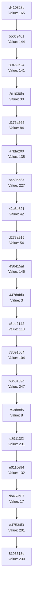

# Hash Chain Visualization

```mermaid
graph TD
    C0["8193318e<br/>Value: 230"]
    C1["a47534f3<br/>Value: 201"]
    C1 --> C0
    C2["db469c07<br/>Value: 17"]
    C2 --> C1
    C3["e011ce94<br/>Value: 132"]
    C3 --> C2
    C4["d89113f2<br/>Value: 231"]
    C4 --> C3
    C5["793d88f5<br/>Value: 8"]
    C5 --> C4
    C6["b8b0139d<br/>Value: 247"]
    C6 --> C5
    C7["730e1b04<br/>Value: 104"]
    C7 --> C6
    C8["c5ee2142<br/>Value: 110"]
    C8 --> C7
    C9["447dafd0<br/>Value: 3"]
    C9 --> C8
    C10["430415af<br/>Value: 146"]
    C10 --> C9
    C11["d278a915<br/>Value: 54"]
    C11 --> C10
    C12["42b8e821<br/>Value: 42"]
    C12 --> C11
    C13["bab0bb6e<br/>Value: 227"]
    C13 --> C12
    C14["a7bfa200<br/>Value: 135"]
    C14 --> C13
    C15["d176a565<br/>Value: 84"]
    C15 --> C14
    C16["2d1030fa<br/>Value: 30"]
    C16 --> C15
    C17["80469d24<br/>Value: 141"]
    C17 --> C16
    C18["550c9461<br/>Value: 144"]
    C18 --> C17
    C19["d410828c<br/>Value: 165"]
    C19 --> C18
```