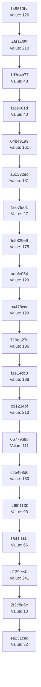

# Hash Chain Visualization

```mermaid
graph TD
    C0["ee231ced<br/>Value: 32"]
    C1["2f2e8d6e<br/>Value: 10"]
    C1 --> C0
    C2["d139ee4c<br/>Value: 241"]
    C2 --> C1
    C3["1841dd4c<br/>Value: 66"]
    C3 --> C2
    C4["cd901130<br/>Value: 93"]
    C4 --> C3
    C5["c2e498d6<br/>Value: 180"]
    C5 --> C4
    C6["06779688<br/>Value: 111"]
    C6 --> C5
    C7["c91234bf<br/>Value: 213"]
    C7 --> C6
    C8["f1e14cb8<br/>Value: 188"]
    C8 --> C7
    C9["719ea27a<br/>Value: 136"]
    C9 --> C8
    C10["ba478cac<br/>Value: 129"]
    C10 --> C9
    C11["adbfe054<br/>Value: 129"]
    C11 --> C10
    C12["fe5829e9<br/>Value: 175"]
    C12 --> C11
    C13["1c07fd01<br/>Value: 27"]
    C13 --> C12
    C14["a61332ed<br/>Value: 131"]
    C14 --> C13
    C15["04b491a9<br/>Value: 161"]
    C15 --> C14
    C16["f1ce661d<br/>Value: 40"]
    C16 --> C15
    C17["1d3d4b77<br/>Value: 48"]
    C17 --> C16
    C18["4f41465f<br/>Value: 210"]
    C18 --> C17
    C19["148810ba<br/>Value: 126"]
    C19 --> C18
```