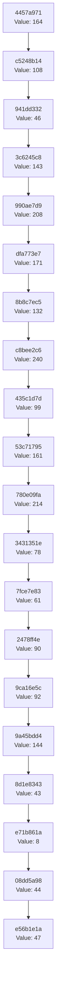

# Hash Chain Visualization

```mermaid
graph TD
    C0["e56b1e1a<br/>Value: 47"]
    C1["08dd5a98<br/>Value: 44"]
    C1 --> C0
    C2["e71b861a<br/>Value: 8"]
    C2 --> C1
    C3["8d1e8343<br/>Value: 43"]
    C3 --> C2
    C4["9a45bdd4<br/>Value: 144"]
    C4 --> C3
    C5["9ca16e5c<br/>Value: 92"]
    C5 --> C4
    C6["2478ff4e<br/>Value: 90"]
    C6 --> C5
    C7["7fce7e83<br/>Value: 61"]
    C7 --> C6
    C8["3431351e<br/>Value: 78"]
    C8 --> C7
    C9["780e09fa<br/>Value: 214"]
    C9 --> C8
    C10["53c71795<br/>Value: 161"]
    C10 --> C9
    C11["435c1d7d<br/>Value: 99"]
    C11 --> C10
    C12["c8bee2c6<br/>Value: 240"]
    C12 --> C11
    C13["8b8c7ec5<br/>Value: 132"]
    C13 --> C12
    C14["dfa773e7<br/>Value: 171"]
    C14 --> C13
    C15["990ae7d9<br/>Value: 208"]
    C15 --> C14
    C16["3c6245c8<br/>Value: 143"]
    C16 --> C15
    C17["941dd332<br/>Value: 46"]
    C17 --> C16
    C18["c5248b14<br/>Value: 108"]
    C18 --> C17
    C19["4457a971<br/>Value: 164"]
    C19 --> C18
```