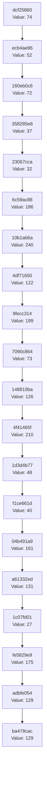

# Hash Chain Visualization

```mermaid
graph TD
    C0["ba478cac<br/>Value: 129"]
    C1["adbfe054<br/>Value: 129"]
    C1 --> C0
    C2["fe5829e9<br/>Value: 175"]
    C2 --> C1
    C3["1c07fd01<br/>Value: 27"]
    C3 --> C2
    C4["a61332ed<br/>Value: 131"]
    C4 --> C3
    C5["04b491a9<br/>Value: 161"]
    C5 --> C4
    C6["f1ce661d<br/>Value: 40"]
    C6 --> C5
    C7["1d3d4b77<br/>Value: 48"]
    C7 --> C6
    C8["4f41465f<br/>Value: 210"]
    C8 --> C7
    C9["148810ba<br/>Value: 126"]
    C9 --> C8
    C10["7090c864<br/>Value: 73"]
    C10 --> C9
    C11["9fecc314<br/>Value: 199"]
    C11 --> C10
    C12["4df71650<br/>Value: 122"]
    C12 --> C11
    C13["10b1ab6a<br/>Value: 240"]
    C13 --> C12
    C14["6c59ac88<br/>Value: 186"]
    C14 --> C13
    C15["23067cca<br/>Value: 32"]
    C15 --> C14
    C16["358285e8<br/>Value: 37"]
    C16 --> C15
    C17["160eb0c6<br/>Value: 72"]
    C17 --> C16
    C18["ecb4ae86<br/>Value: 52"]
    C18 --> C17
    C19["dcf25860<br/>Value: 74"]
    C19 --> C18
```