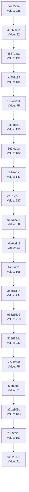

# Hash Chain Visualization

```mermaid
graph TD
    C0["92628110<br/>Value: 41"]
    C1["7cb0556b<br/>Value: 157"]
    C1 --> C0
    C2["a2da309d<br/>Value: 183"]
    C2 --> C1
    C3["f75d0fe2<br/>Value: 81"]
    C3 --> C2
    C4["77212eaf<br/>Value: 75"]
    C4 --> C3
    C5["518615dc<br/>Value: 232"]
    C5 --> C4
    C6["938a6de2<br/>Value: 210"]
    C6 --> C5
    C7["3bda1d1b<br/>Value: 234"]
    C7 --> C6
    C8["4a5b4fa1<br/>Value: 195"]
    C8 --> C7
    C9["a6a0cdb8<br/>Value: 44"]
    C9 --> C8
    C10["6d83a014<br/>Value: 50"]
    C10 --> C9
    C11["ea517270<br/>Value: 237"]
    C11 --> C10
    C12["0b99e0fc<br/>Value: 141"]
    C12 --> C11
    C13["669f0de8<br/>Value: 102"]
    C13 --> C12
    C14["0c04b7f1<br/>Value: 153"]
    C14 --> C13
    C15["1094a631<br/>Value: 75"]
    C15 --> C14
    C16["ac502197<br/>Value: 184"]
    C16 --> C15
    C17["4567eaac<br/>Value: 191"]
    C17 --> C16
    C18["4166008d<br/>Value: 92"]
    C18 --> C17
    C19["cea256fe<br/>Value: 228"]
    C19 --> C18
```