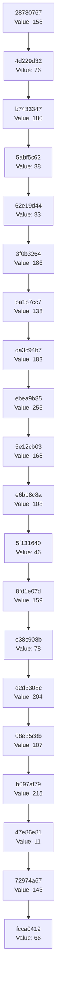

# Hash Chain Visualization

```mermaid
graph TD
    C0["fcca0419<br/>Value: 66"]
    C1["72974a67<br/>Value: 143"]
    C1 --> C0
    C2["47e86e81<br/>Value: 11"]
    C2 --> C1
    C3["b097af79<br/>Value: 215"]
    C3 --> C2
    C4["08e35c8b<br/>Value: 107"]
    C4 --> C3
    C5["d2d3308c<br/>Value: 204"]
    C5 --> C4
    C6["e38c908b<br/>Value: 78"]
    C6 --> C5
    C7["8fd1e07d<br/>Value: 159"]
    C7 --> C6
    C8["5f131640<br/>Value: 46"]
    C8 --> C7
    C9["e6bb8c8a<br/>Value: 108"]
    C9 --> C8
    C10["5e12cb03<br/>Value: 168"]
    C10 --> C9
    C11["ebea9b85<br/>Value: 255"]
    C11 --> C10
    C12["da3c94b7<br/>Value: 182"]
    C12 --> C11
    C13["ba1b7cc7<br/>Value: 138"]
    C13 --> C12
    C14["3f0b3264<br/>Value: 186"]
    C14 --> C13
    C15["62e19d44<br/>Value: 33"]
    C15 --> C14
    C16["5abf5c62<br/>Value: 38"]
    C16 --> C15
    C17["b7433347<br/>Value: 180"]
    C17 --> C16
    C18["4d229d32<br/>Value: 76"]
    C18 --> C17
    C19["28780767<br/>Value: 158"]
    C19 --> C18
```