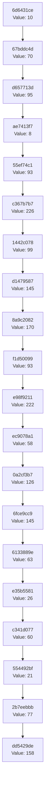

# Hash Chain Visualization

```mermaid
graph TD
    C0["dd5429de<br/>Value: 158"]
    C1["2b7eebbb<br/>Value: 77"]
    C1 --> C0
    C2["554492bf<br/>Value: 21"]
    C2 --> C1
    C3["c341d077<br/>Value: 60"]
    C3 --> C2
    C4["e35b5581<br/>Value: 26"]
    C4 --> C3
    C5["6133889e<br/>Value: 63"]
    C5 --> C4
    C6["6fce9cc9<br/>Value: 145"]
    C6 --> C5
    C7["0a2cf3b7<br/>Value: 126"]
    C7 --> C6
    C8["ec9078a1<br/>Value: 58"]
    C8 --> C7
    C9["e98f9211<br/>Value: 222"]
    C9 --> C8
    C10["f1d50099<br/>Value: 93"]
    C10 --> C9
    C11["8a9c2082<br/>Value: 170"]
    C11 --> C10
    C12["d1479587<br/>Value: 145"]
    C12 --> C11
    C13["1442c078<br/>Value: 99"]
    C13 --> C12
    C14["c367b7b7<br/>Value: 226"]
    C14 --> C13
    C15["55ef74c1<br/>Value: 93"]
    C15 --> C14
    C16["ae7413f7<br/>Value: 8"]
    C16 --> C15
    C17["d657713d<br/>Value: 95"]
    C17 --> C16
    C18["67bddc4d<br/>Value: 70"]
    C18 --> C17
    C19["6d6431ce<br/>Value: 10"]
    C19 --> C18
```