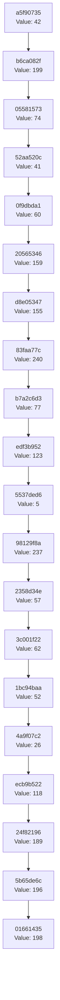

# Hash Chain Visualization

```mermaid
graph TD
    C0["01661435<br/>Value: 198"]
    C1["5b65de6c<br/>Value: 196"]
    C1 --> C0
    C2["24f82196<br/>Value: 189"]
    C2 --> C1
    C3["ecb9b522<br/>Value: 118"]
    C3 --> C2
    C4["4a9f07c2<br/>Value: 26"]
    C4 --> C3
    C5["1bc94baa<br/>Value: 52"]
    C5 --> C4
    C6["3c001f22<br/>Value: 62"]
    C6 --> C5
    C7["2358d34e<br/>Value: 57"]
    C7 --> C6
    C8["98129f8a<br/>Value: 237"]
    C8 --> C7
    C9["5537ded6<br/>Value: 5"]
    C9 --> C8
    C10["edf3b952<br/>Value: 123"]
    C10 --> C9
    C11["b7a2c6d3<br/>Value: 77"]
    C11 --> C10
    C12["83faa77c<br/>Value: 240"]
    C12 --> C11
    C13["d8e05347<br/>Value: 155"]
    C13 --> C12
    C14["20565346<br/>Value: 159"]
    C14 --> C13
    C15["0f9dbda1<br/>Value: 60"]
    C15 --> C14
    C16["52aa520c<br/>Value: 41"]
    C16 --> C15
    C17["05581573<br/>Value: 74"]
    C17 --> C16
    C18["b6ca082f<br/>Value: 199"]
    C18 --> C17
    C19["a5f90735<br/>Value: 42"]
    C19 --> C18
```