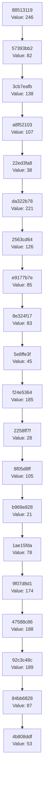

# Hash Chain Visualization

```mermaid
graph TD
    C0["4b808ddf<br/>Value: 53"]
    C1["84bb6828<br/>Value: 87"]
    C1 --> C0
    C2["92c3c48c<br/>Value: 189"]
    C2 --> C1
    C3["47588c86<br/>Value: 188"]
    C3 --> C2
    C4["9f07d8d1<br/>Value: 174"]
    C4 --> C3
    C5["1ae15fda<br/>Value: 78"]
    C5 --> C4
    C6["b969e828<br/>Value: 21"]
    C6 --> C5
    C7["8f05d8ff<br/>Value: 105"]
    C7 --> C6
    C8["2258ff7f<br/>Value: 28"]
    C8 --> C7
    C9["f24e5364<br/>Value: 185"]
    C9 --> C8
    C10["5e8ffe3f<br/>Value: 45"]
    C10 --> C9
    C11["8e324f17<br/>Value: 83"]
    C11 --> C10
    C12["e9177b7e<br/>Value: 85"]
    C12 --> C11
    C13["2563cd64<br/>Value: 126"]
    C13 --> C12
    C14["da322b78<br/>Value: 221"]
    C14 --> C13
    C15["22ed3fa8<br/>Value: 38"]
    C15 --> C14
    C16["a8f52103<br/>Value: 107"]
    C16 --> C15
    C17["3cb7eafb<br/>Value: 138"]
    C17 --> C16
    C18["57393bb2<br/>Value: 82"]
    C18 --> C17
    C19["88513119<br/>Value: 246"]
    C19 --> C18
```