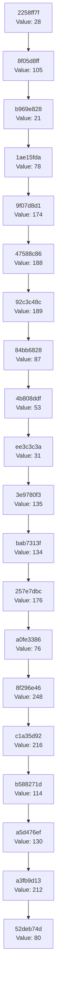

# Hash Chain Visualization

```mermaid
graph TD
    C0["52deb74d<br/>Value: 80"]
    C1["a3fb9d13<br/>Value: 212"]
    C1 --> C0
    C2["a5d476ef<br/>Value: 130"]
    C2 --> C1
    C3["b588271d<br/>Value: 114"]
    C3 --> C2
    C4["c1a35d92<br/>Value: 216"]
    C4 --> C3
    C5["8f296e46<br/>Value: 248"]
    C5 --> C4
    C6["a0fe3386<br/>Value: 76"]
    C6 --> C5
    C7["257e7dbc<br/>Value: 176"]
    C7 --> C6
    C8["bab7313f<br/>Value: 134"]
    C8 --> C7
    C9["3e9780f3<br/>Value: 135"]
    C9 --> C8
    C10["ee3c3c3a<br/>Value: 31"]
    C10 --> C9
    C11["4b808ddf<br/>Value: 53"]
    C11 --> C10
    C12["84bb6828<br/>Value: 87"]
    C12 --> C11
    C13["92c3c48c<br/>Value: 189"]
    C13 --> C12
    C14["47588c86<br/>Value: 188"]
    C14 --> C13
    C15["9f07d8d1<br/>Value: 174"]
    C15 --> C14
    C16["1ae15fda<br/>Value: 78"]
    C16 --> C15
    C17["b969e828<br/>Value: 21"]
    C17 --> C16
    C18["8f05d8ff<br/>Value: 105"]
    C18 --> C17
    C19["2258ff7f<br/>Value: 28"]
    C19 --> C18
```