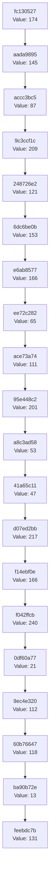

# Hash Chain Visualization

```mermaid
graph TD
    C0["feebdc7b<br/>Value: 131"]
    C1["ba90b72e<br/>Value: 13"]
    C1 --> C0
    C2["60b76647<br/>Value: 118"]
    C2 --> C1
    C3["9ec4e320<br/>Value: 112"]
    C3 --> C2
    C4["0df60a77<br/>Value: 21"]
    C4 --> C3
    C5["f042ffcb<br/>Value: 240"]
    C5 --> C4
    C6["f14ebf0e<br/>Value: 166"]
    C6 --> C5
    C7["d07ed2bb<br/>Value: 217"]
    C7 --> C6
    C8["41a65c11<br/>Value: 47"]
    C8 --> C7
    C9["a8c3ad58<br/>Value: 53"]
    C9 --> C8
    C10["95e448c2<br/>Value: 201"]
    C10 --> C9
    C11["ace73a74<br/>Value: 111"]
    C11 --> C10
    C12["ee72c282<br/>Value: 65"]
    C12 --> C11
    C13["e6ab8577<br/>Value: 166"]
    C13 --> C12
    C14["6dc6be0b<br/>Value: 153"]
    C14 --> C13
    C15["248726e2<br/>Value: 121"]
    C15 --> C14
    C16["9c3ccf1c<br/>Value: 209"]
    C16 --> C15
    C17["accc3bc5<br/>Value: 87"]
    C17 --> C16
    C18["aada9895<br/>Value: 145"]
    C18 --> C17
    C19["fc130527<br/>Value: 174"]
    C19 --> C18
```