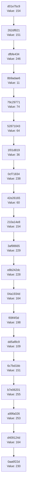

# Hash Chain Visualization

```mermaid
graph TD
    C0["0aa6f22d<br/>Value: 230"]
    C1["d409124d<br/>Value: 164"]
    C1 --> C0
    C2["a99fa026<br/>Value: 253"]
    C2 --> C1
    C3["b7e06201<br/>Value: 255"]
    C3 --> C2
    C4["6c7bd1bb<br/>Value: 151"]
    C4 --> C3
    C5["dd5af8c9<br/>Value: 109"]
    C5 --> C4
    C6["f09f4f3d<br/>Value: 198"]
    C6 --> C5
    C7["04a1934d<br/>Value: 164"]
    C7 --> C6
    C8["e8b242dc<br/>Value: 228"]
    C8 --> C7
    C9["3af98665<br/>Value: 229"]
    C9 --> C8
    C10["210a14e8<br/>Value: 154"]
    C10 --> C9
    C11["42e26165<br/>Value: 60"]
    C11 --> C10
    C12["0cf71834<br/>Value: 238"]
    C12 --> C11
    C13["1f01d819<br/>Value: 36"]
    C13 --> C12
    C14["52871043<br/>Value: 64"]
    C14 --> C13
    C15["79c29771<br/>Value: 74"]
    C15 --> C14
    C16["8b9adae6<br/>Value: 11"]
    C16 --> C15
    C17["dfbfe434<br/>Value: 246"]
    C17 --> C16
    C18["262df821<br/>Value: 151"]
    C18 --> C17
    C19["d01e7bc9<br/>Value: 154"]
    C19 --> C18
```