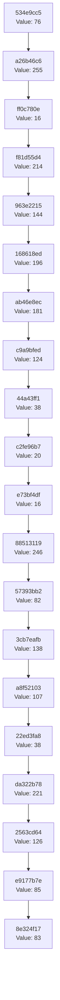

# Hash Chain Visualization

```mermaid
graph TD
    C0["8e324f17<br/>Value: 83"]
    C1["e9177b7e<br/>Value: 85"]
    C1 --> C0
    C2["2563cd64<br/>Value: 126"]
    C2 --> C1
    C3["da322b78<br/>Value: 221"]
    C3 --> C2
    C4["22ed3fa8<br/>Value: 38"]
    C4 --> C3
    C5["a8f52103<br/>Value: 107"]
    C5 --> C4
    C6["3cb7eafb<br/>Value: 138"]
    C6 --> C5
    C7["57393bb2<br/>Value: 82"]
    C7 --> C6
    C8["88513119<br/>Value: 246"]
    C8 --> C7
    C9["e73bf4df<br/>Value: 16"]
    C9 --> C8
    C10["c2fe96b7<br/>Value: 20"]
    C10 --> C9
    C11["44a43ff1<br/>Value: 38"]
    C11 --> C10
    C12["c9a9bfed<br/>Value: 124"]
    C12 --> C11
    C13["ab46e8ec<br/>Value: 181"]
    C13 --> C12
    C14["168618ed<br/>Value: 196"]
    C14 --> C13
    C15["963e2215<br/>Value: 144"]
    C15 --> C14
    C16["f81d55d4<br/>Value: 214"]
    C16 --> C15
    C17["ff0c780e<br/>Value: 16"]
    C17 --> C16
    C18["a26b46c6<br/>Value: 255"]
    C18 --> C17
    C19["534e9cc5<br/>Value: 76"]
    C19 --> C18
```