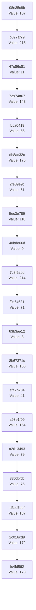

# Hash Chain Visualization

```mermaid
graph TD
    C0["fc4fd562<br/>Value: 173"]
    C1["2c016cd9<br/>Value: 172"]
    C1 --> C0
    C2["d3ec7bbf<br/>Value: 187"]
    C2 --> C1
    C3["330dbfdc<br/>Value: 75"]
    C3 --> C2
    C4["a2613493<br/>Value: 79"]
    C4 --> C3
    C5["a93e1f09<br/>Value: 154"]
    C5 --> C4
    C6["efa2b204<br/>Value: 41"]
    C6 --> C5
    C7["8b67371c<br/>Value: 166"]
    C7 --> C6
    C8["63b3aa12<br/>Value: 8"]
    C8 --> C7
    C9["f0c64631<br/>Value: 71"]
    C9 --> C8
    C10["7c8f9abd<br/>Value: 214"]
    C10 --> C9
    C11["40bde66d<br/>Value: 0"]
    C11 --> C10
    C12["5ec3e789<br/>Value: 118"]
    C12 --> C11
    C13["2fe89e9c<br/>Value: 51"]
    C13 --> C12
    C14["db8ac32c<br/>Value: 175"]
    C14 --> C13
    C15["fcca0419<br/>Value: 66"]
    C15 --> C14
    C16["72974a67<br/>Value: 143"]
    C16 --> C15
    C17["47e86e81<br/>Value: 11"]
    C17 --> C16
    C18["b097af79<br/>Value: 215"]
    C18 --> C17
    C19["08e35c8b<br/>Value: 107"]
    C19 --> C18
```