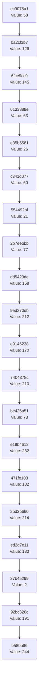

# Hash Chain Visualization

```mermaid
graph TD
    C0["b58bbf5f<br/>Value: 244"]
    C1["92bc326c<br/>Value: 191"]
    C1 --> C0
    C2["37b45299<br/>Value: 2"]
    C2 --> C1
    C3["ed2d7e11<br/>Value: 183"]
    C3 --> C2
    C4["2bd3b660<br/>Value: 214"]
    C4 --> C3
    C5["471fe103<br/>Value: 182"]
    C5 --> C4
    C6["e19b4612<br/>Value: 232"]
    C6 --> C5
    C7["be426a51<br/>Value: 73"]
    C7 --> C6
    C8["7404378c<br/>Value: 210"]
    C8 --> C7
    C9["e9146238<br/>Value: 170"]
    C9 --> C8
    C10["9ed270db<br/>Value: 212"]
    C10 --> C9
    C11["dd5429de<br/>Value: 158"]
    C11 --> C10
    C12["2b7eebbb<br/>Value: 77"]
    C12 --> C11
    C13["554492bf<br/>Value: 21"]
    C13 --> C12
    C14["c341d077<br/>Value: 60"]
    C14 --> C13
    C15["e35b5581<br/>Value: 26"]
    C15 --> C14
    C16["6133889e<br/>Value: 63"]
    C16 --> C15
    C17["6fce9cc9<br/>Value: 145"]
    C17 --> C16
    C18["0a2cf3b7<br/>Value: 126"]
    C18 --> C17
    C19["ec9078a1<br/>Value: 58"]
    C19 --> C18
```