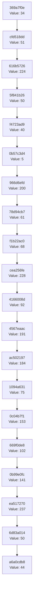

# Hash Chain Visualization

```mermaid
graph TD
    C0["a6a0cdb8<br/>Value: 44"]
    C1["6d83a014<br/>Value: 50"]
    C1 --> C0
    C2["ea517270<br/>Value: 237"]
    C2 --> C1
    C3["0b99e0fc<br/>Value: 141"]
    C3 --> C2
    C4["669f0de8<br/>Value: 102"]
    C4 --> C3
    C5["0c04b7f1<br/>Value: 153"]
    C5 --> C4
    C6["1094a631<br/>Value: 75"]
    C6 --> C5
    C7["ac502197<br/>Value: 184"]
    C7 --> C6
    C8["4567eaac<br/>Value: 191"]
    C8 --> C7
    C9["4166008d<br/>Value: 92"]
    C9 --> C8
    C10["cea256fe<br/>Value: 228"]
    C10 --> C9
    C11["f1b22ac0<br/>Value: 68"]
    C11 --> C10
    C12["78d94cb7<br/>Value: 61"]
    C12 --> C11
    C13["966d6efd<br/>Value: 200"]
    C13 --> C12
    C14["0b57c3d4<br/>Value: 5"]
    C14 --> C13
    C15["f4723ad9<br/>Value: 40"]
    C15 --> C14
    C16["5f841b26<br/>Value: 50"]
    C16 --> C15
    C17["616b5726<br/>Value: 224"]
    C17 --> C16
    C18["cfd518dd<br/>Value: 51"]
    C18 --> C17
    C19["369a7f0e<br/>Value: 34"]
    C19 --> C18
```