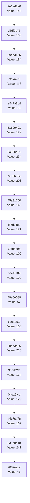

# Hash Chain Visualization

```mermaid
graph TD
    C0["7887eadc<br/>Value: 41"]
    C1["931ebe18<br/>Value: 241"]
    C1 --> C0
    C2["e6c7cb76<br/>Value: 167"]
    C2 --> C1
    C3["04e15fcb<br/>Value: 123"]
    C3 --> C2
    C4["36cdc2fc<br/>Value: 134"]
    C4 --> C3
    C5["2bea3e96<br/>Value: 218"]
    C5 --> C4
    C6["cd0af262<br/>Value: 106"]
    C6 --> C5
    C7["49e0e089<br/>Value: 57"]
    C7 --> C6
    C8["5aef6e89<br/>Value: 199"]
    C8 --> C7
    C9["69fd5e96<br/>Value: 109"]
    C9 --> C8
    C10["f86dc4ee<br/>Value: 121"]
    C10 --> C9
    C11["45a31750<br/>Value: 145"]
    C11 --> C10
    C12["ce35b33e<br/>Value: 203"]
    C12 --> C11
    C13["5a68bd31<br/>Value: 234"]
    C13 --> C12
    C14["51609491<br/>Value: 129"]
    C14 --> C13
    C15["a5c7a8cd<br/>Value: 73"]
    C15 --> C14
    C16["cff8a481<br/>Value: 112"]
    C16 --> C15
    C17["29cb3156<br/>Value: 184"]
    C17 --> C16
    C18["d3df0b73<br/>Value: 100"]
    C18 --> C17
    C19["9e1ad2e0<br/>Value: 148"]
    C19 --> C18
```