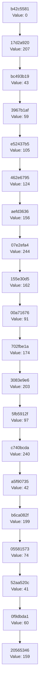

# Hash Chain Visualization

```mermaid
graph TD
    C0["20565346<br/>Value: 159"]
    C1["0f9dbda1<br/>Value: 60"]
    C1 --> C0
    C2["52aa520c<br/>Value: 41"]
    C2 --> C1
    C3["05581573<br/>Value: 74"]
    C3 --> C2
    C4["b6ca082f<br/>Value: 199"]
    C4 --> C3
    C5["a5f90735<br/>Value: 42"]
    C5 --> C4
    C6["c740bcda<br/>Value: 240"]
    C6 --> C5
    C7["5fb5912f<br/>Value: 97"]
    C7 --> C6
    C8["3083e9e6<br/>Value: 203"]
    C8 --> C7
    C9["702fbe1a<br/>Value: 174"]
    C9 --> C8
    C10["00a71676<br/>Value: 91"]
    C10 --> C9
    C11["155e30d5<br/>Value: 162"]
    C11 --> C10
    C12["07e2efa4<br/>Value: 244"]
    C12 --> C11
    C13["aefd3636<br/>Value: 156"]
    C13 --> C12
    C14["462e6795<br/>Value: 124"]
    C14 --> C13
    C15["e52437b5<br/>Value: 105"]
    C15 --> C14
    C16["3967b1af<br/>Value: 59"]
    C16 --> C15
    C17["bc493b19<br/>Value: 43"]
    C17 --> C16
    C18["17d2a920<br/>Value: 207"]
    C18 --> C17
    C19["b42c5581<br/>Value: 0"]
    C19 --> C18
```