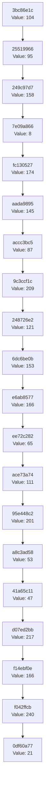

# Hash Chain Visualization

```mermaid
graph TD
    C0["0df60a77<br/>Value: 21"]
    C1["f042ffcb<br/>Value: 240"]
    C1 --> C0
    C2["f14ebf0e<br/>Value: 166"]
    C2 --> C1
    C3["d07ed2bb<br/>Value: 217"]
    C3 --> C2
    C4["41a65c11<br/>Value: 47"]
    C4 --> C3
    C5["a8c3ad58<br/>Value: 53"]
    C5 --> C4
    C6["95e448c2<br/>Value: 201"]
    C6 --> C5
    C7["ace73a74<br/>Value: 111"]
    C7 --> C6
    C8["ee72c282<br/>Value: 65"]
    C8 --> C7
    C9["e6ab8577<br/>Value: 166"]
    C9 --> C8
    C10["6dc6be0b<br/>Value: 153"]
    C10 --> C9
    C11["248726e2<br/>Value: 121"]
    C11 --> C10
    C12["9c3ccf1c<br/>Value: 209"]
    C12 --> C11
    C13["accc3bc5<br/>Value: 87"]
    C13 --> C12
    C14["aada9895<br/>Value: 145"]
    C14 --> C13
    C15["fc130527<br/>Value: 174"]
    C15 --> C14
    C16["7e09a866<br/>Value: 8"]
    C16 --> C15
    C17["249c97d7<br/>Value: 158"]
    C17 --> C16
    C18["25519966<br/>Value: 95"]
    C18 --> C17
    C19["3bc86e1c<br/>Value: 104"]
    C19 --> C18
```