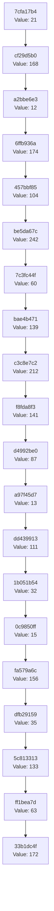

# Hash Chain Visualization

```mermaid
graph TD
    C0["33b1dc4f<br/>Value: 172"]
    C1["ff1bea7d<br/>Value: 63"]
    C1 --> C0
    C2["5c813313<br/>Value: 133"]
    C2 --> C1
    C3["dfb29159<br/>Value: 35"]
    C3 --> C2
    C4["fa579a6c<br/>Value: 156"]
    C4 --> C3
    C5["0c9850ff<br/>Value: 15"]
    C5 --> C4
    C6["1b051b54<br/>Value: 32"]
    C6 --> C5
    C7["dd439913<br/>Value: 111"]
    C7 --> C6
    C8["a97f45d7<br/>Value: 13"]
    C8 --> C7
    C9["d4992be0<br/>Value: 87"]
    C9 --> C8
    C10["f8fda8f3<br/>Value: 141"]
    C10 --> C9
    C11["c3c8e7c2<br/>Value: 212"]
    C11 --> C10
    C12["bae4b471<br/>Value: 139"]
    C12 --> C11
    C13["7c3fc44f<br/>Value: 60"]
    C13 --> C12
    C14["be5da67c<br/>Value: 242"]
    C14 --> C13
    C15["457bbf85<br/>Value: 104"]
    C15 --> C14
    C16["6ffb936a<br/>Value: 174"]
    C16 --> C15
    C17["a2bbe6e3<br/>Value: 12"]
    C17 --> C16
    C18["cf29d5b0<br/>Value: 168"]
    C18 --> C17
    C19["7cfa17b4<br/>Value: 21"]
    C19 --> C18
```