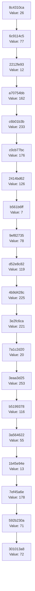

# Hash Chain Visualization

```mermaid
graph TD
    C0["301013a8<br/>Value: 72"]
    C1["592b230a<br/>Value: 71"]
    C1 --> C0
    C2["7ef45a6e<br/>Value: 178"]
    C2 --> C1
    C3["1b45e94e<br/>Value: 13"]
    C3 --> C2
    C4["3a564622<br/>Value: 55"]
    C4 --> C3
    C5["b5199378<br/>Value: 116"]
    C5 --> C4
    C6["3eaa3d25<br/>Value: 253"]
    C6 --> C5
    C7["7a1c2d20<br/>Value: 20"]
    C7 --> C6
    C8["3e2fc6ca<br/>Value: 221"]
    C8 --> C7
    C9["4b9d428c<br/>Value: 225"]
    C9 --> C8
    C10["d52e8c82<br/>Value: 119"]
    C10 --> C9
    C11["9ef82735<br/>Value: 78"]
    C11 --> C10
    C12["b561b6ff<br/>Value: 7"]
    C12 --> C11
    C13["2414bd62<br/>Value: 126"]
    C13 --> C12
    C14["c0cb77bc<br/>Value: 176"]
    C14 --> C13
    C15["c6b01b3b<br/>Value: 233"]
    C15 --> C14
    C16["a70754bb<br/>Value: 162"]
    C16 --> C15
    C17["2212fe93<br/>Value: 12"]
    C17 --> C16
    C18["6c9114c5<br/>Value: 77"]
    C18 --> C17
    C19["8c4310ca<br/>Value: 26"]
    C19 --> C18
```