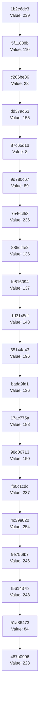

# Hash Chain Visualization

```mermaid
graph TD
    C0["487a0996<br/>Value: 223"]
    C1["51a86473<br/>Value: 84"]
    C1 --> C0
    C2["f561437b<br/>Value: 248"]
    C2 --> C1
    C3["9e756fb7<br/>Value: 246"]
    C3 --> C2
    C4["4c39e020<br/>Value: 254"]
    C4 --> C3
    C5["fb0c1cdc<br/>Value: 237"]
    C5 --> C4
    C6["98d06713<br/>Value: 150"]
    C6 --> C5
    C7["17ac775a<br/>Value: 183"]
    C7 --> C6
    C8["bada9fd1<br/>Value: 136"]
    C8 --> C7
    C9["65144a43<br/>Value: 196"]
    C9 --> C8
    C10["1d3145cf<br/>Value: 143"]
    C10 --> C9
    C11["fe816094<br/>Value: 137"]
    C11 --> C10
    C12["885cf4e2<br/>Value: 136"]
    C12 --> C11
    C13["7e46cf53<br/>Value: 236"]
    C13 --> C12
    C14["9d780c67<br/>Value: 89"]
    C14 --> C13
    C15["87c65d1d<br/>Value: 8"]
    C15 --> C14
    C16["dd37ad63<br/>Value: 155"]
    C16 --> C15
    C17["c206be86<br/>Value: 28"]
    C17 --> C16
    C18["5f11838b<br/>Value: 110"]
    C18 --> C17
    C19["1b2e6dc3<br/>Value: 239"]
    C19 --> C18
```