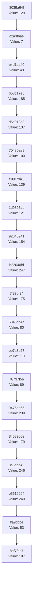

# Hash Chain Visualization

```mermaid
graph TD
    C0["8ef7fbb7<br/>Value: 187"]
    C1["ffa9dcbe<br/>Value: 53"]
    C1 --> C0
    C2["e5612294<br/>Value: 240"]
    C2 --> C1
    C3["3a6dba42<br/>Value: 246"]
    C3 --> C2
    C4["84589d6e<br/>Value: 179"]
    C4 --> C3
    C5["9475ee65<br/>Value: 239"]
    C5 --> C4
    C6["78737f5b<br/>Value: 89"]
    C6 --> C5
    C7["eb7a8e27<br/>Value: 110"]
    C7 --> C6
    C8["5345dd4a<br/>Value: 80"]
    C8 --> C7
    C9["7f37bf34<br/>Value: 175"]
    C9 --> C8
    C10["b22040fd<br/>Value: 247"]
    C10 --> C9
    C11["92045941<br/>Value: 154"]
    C11 --> C10
    C12["1d9895ab<br/>Value: 121"]
    C12 --> C11
    C13["f18079a1<br/>Value: 139"]
    C13 --> C12
    C14["70480ae9<br/>Value: 100"]
    C14 --> C13
    C15["d6e918e3<br/>Value: 137"]
    C15 --> C14
    C16["658d17e5<br/>Value: 185"]
    C16 --> C15
    C17["b4d1aa40<br/>Value: 40"]
    C17 --> C16
    C18["c2a3fbae<br/>Value: 7"]
    C18 --> C17
    C19["3039a64f<br/>Value: 129"]
    C19 --> C18
```