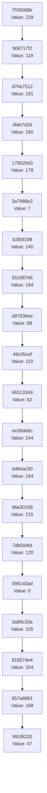

# Hash Chain Visualization

```mermaid
graph TD
    C0["991f6220<br/>Value: 47"]
    C1["857a8861<br/>Value: 168"]
    C1 --> C0
    C2["81857de4<br/>Value: 204"]
    C2 --> C1
    C3["3a88c33a<br/>Value: 105"]
    C3 --> C2
    C4["399140ad<br/>Value: 0"]
    C4 --> C3
    C5["7db594fd<br/>Value: 120"]
    C5 --> C4
    C6["d6a30158<br/>Value: 215"]
    C6 --> C5
    C7["dd84ac50<br/>Value: 164"]
    C7 --> C6
    C8["ee39dd6c<br/>Value: 244"]
    C8 --> C7
    C9["66513349<br/>Value: 62"]
    C9 --> C8
    C10["49c05cef<br/>Value: 110"]
    C10 --> C9
    C11["a97636ee<br/>Value: 68"]
    C11 --> C10
    C12["55168766<br/>Value: 194"]
    C12 --> C11
    C13["b285f198<br/>Value: 140"]
    C13 --> C12
    C14["3a7988e2<br/>Value: 7"]
    C14 --> C13
    C15["179520d3<br/>Value: 178"]
    C15 --> C14
    C16["4feb7d26<br/>Value: 160"]
    C16 --> C15
    C17["d70e7512<br/>Value: 191"]
    C17 --> C16
    C18["908717f2<br/>Value: 119"]
    C18 --> C17
    C19["f709069b<br/>Value: 229"]
    C19 --> C18
```