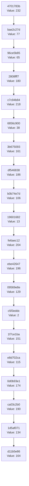

# Hash Chain Visualization

```mermaid
graph TD
    C0["d11b5e86<br/>Value: 164"]
    C1["1d5af071<br/>Value: 134"]
    C1 --> C0
    C2["ca03c2b0<br/>Value: 190"]
    C2 --> C1
    C3["0d0b93e1<br/>Value: 174"]
    C3 --> C2
    C4["e8d702ca<br/>Value: 115"]
    C4 --> C3
    C5["1f7ce1ba<br/>Value: 151"]
    C5 --> C4
    C6["c5f3eddc<br/>Value: 2"]
    C6 --> C5
    C7["09569e8e<br/>Value: 129"]
    C7 --> C6
    C8["ebe42647<br/>Value: 196"]
    C8 --> C7
    C9["fe6aec12<br/>Value: 204"]
    C9 --> C8
    C10["19601682<br/>Value: 13"]
    C10 --> C9
    C11["b0b74e7d<br/>Value: 106"]
    C11 --> C10
    C12["df546838<br/>Value: 186"]
    C12 --> C11
    C13["3b675093<br/>Value: 161"]
    C13 --> C12
    C14["6856c900<br/>Value: 38"]
    C14 --> C13
    C15["c7c94b84<br/>Value: 218"]
    C15 --> C14
    C16["2808fff7<br/>Value: 180"]
    C16 --> C15
    C17["96ce5b85<br/>Value: 65"]
    C17 --> C16
    C18["bae2c27d<br/>Value: 77"]
    C18 --> C17
    C19["4701783b<br/>Value: 232"]
    C19 --> C18
```