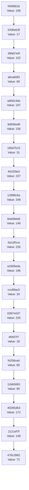

# Hash Chain Visualization

```mermaid
graph TD
    C0["476c3982<br/>Value: 72"]
    C1["2121ef7f<br/>Value: 148"]
    C1 --> C0
    C2["40265db3<br/>Value: 172"]
    C2 --> C1
    C3["11bb5663<br/>Value: 80"]
    C3 --> C2
    C4["f4258ce6<br/>Value: 80"]
    C4 --> C3
    C5["4f05f7f7<br/>Value: 18"]
    C5 --> C4
    C6["63974437<br/>Value: 226"]
    C6 --> C5
    C7["ccc89ac5<br/>Value: 34"]
    C7 --> C6
    C8["a1665eda<br/>Value: 196"]
    C8 --> C7
    C9["6a1df1ca<br/>Value: 226"]
    C9 --> C8
    C10["84e89eb6<br/>Value: 146"]
    C10 --> C9
    C11["12898c6a<br/>Value: 248"]
    C11 --> C10
    C12["461f29e3<br/>Value: 237"]
    C12 --> C11
    C13["185d7b15<br/>Value: 31"]
    C13 --> C12
    C14["3d936ed6<br/>Value: 156"]
    C14 --> C13
    C15["ad0d14da<br/>Value: 197"]
    C15 --> C14
    C16["a6ca6df3<br/>Value: 69"]
    C16 --> C15
    C17["399d744f<br/>Value: 102"]
    C17 --> C16
    C18["0336eb3f<br/>Value: 17"]
    C18 --> C17
    C19["f4098616<br/>Value: 199"]
    C19 --> C18
```