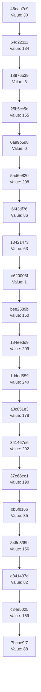

# Hash Chain Visualization

```mermaid
graph TD
    C0["7bcbe9f7<br/>Value: 88"]
    C1["c34e5025<br/>Value: 159"]
    C1 --> C0
    C2["d841437d<br/>Value: 82"]
    C2 --> C1
    C3["846d535b<br/>Value: 156"]
    C3 --> C2
    C4["0b6fb166<br/>Value: 35"]
    C4 --> C3
    C5["37e68ee1<br/>Value: 190"]
    C5 --> C4
    C6["341467e6<br/>Value: 202"]
    C6 --> C5
    C7["a0c051e3<br/>Value: 178"]
    C7 --> C6
    C8["1dded559<br/>Value: 240"]
    C8 --> C7
    C9["184eedd9<br/>Value: 209"]
    C9 --> C8
    C10["bee2589b<br/>Value: 150"]
    C10 --> C9
    C11["e620003f<br/>Value: 1"]
    C11 --> C10
    C12["13421473<br/>Value: 63"]
    C12 --> C11
    C13["66f3df76<br/>Value: 86"]
    C13 --> C12
    C14["5ad6e820<br/>Value: 208"]
    C14 --> C13
    C15["0a99b5d8<br/>Value: 0"]
    C15 --> C14
    C16["25b5cc5e<br/>Value: 155"]
    C16 --> C15
    C17["18976b39<br/>Value: 3"]
    C17 --> C16
    C18["64d22111<br/>Value: 134"]
    C18 --> C17
    C19["46eaa7c9<br/>Value: 30"]
    C19 --> C18
```