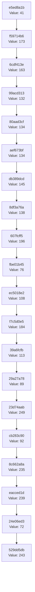

# Hash Chain Visualization

```mermaid
graph TD
    C0["529dd5db<br/>Value: 243"]
    C1["24e06ed3<br/>Value: 72"]
    C1 --> C0
    C2["eacced1d<br/>Value: 239"]
    C2 --> C1
    C3["8c662a8a<br/>Value: 235"]
    C3 --> C2
    C4["cb283c90<br/>Value: 92"]
    C4 --> C3
    C5["23d74aab<br/>Value: 249"]
    C5 --> C4
    C6["29a27a78<br/>Value: 89"]
    C6 --> C5
    C7["39a6fcfb<br/>Value: 113"]
    C7 --> C6
    C8["f7c5d0e5<br/>Value: 184"]
    C8 --> C7
    C9["ec5018e2<br/>Value: 108"]
    C9 --> C8
    C10["fbe01b45<br/>Value: 76"]
    C10 --> C9
    C11["607fcff5<br/>Value: 196"]
    C11 --> C10
    C12["8df3a76a<br/>Value: 138"]
    C12 --> C11
    C13["db389dcd<br/>Value: 145"]
    C13 --> C12
    C14["aef673bf<br/>Value: 134"]
    C14 --> C13
    C15["80aad3cf<br/>Value: 134"]
    C15 --> C14
    C16["99acd313<br/>Value: 132"]
    C16 --> C15
    C17["6cdf413e<br/>Value: 163"]
    C17 --> C16
    C18["f59714b6<br/>Value: 173"]
    C18 --> C17
    C19["e5ed8a1b<br/>Value: 41"]
    C19 --> C18
```