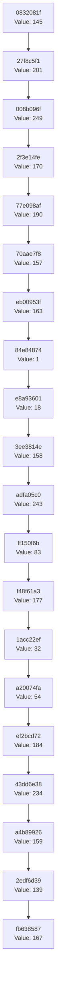

# Hash Chain Visualization

```mermaid
graph TD
    C0["fb638587<br/>Value: 167"]
    C1["2edf6d39<br/>Value: 139"]
    C1 --> C0
    C2["a4b89926<br/>Value: 159"]
    C2 --> C1
    C3["43dd6e38<br/>Value: 234"]
    C3 --> C2
    C4["ef2bcd72<br/>Value: 184"]
    C4 --> C3
    C5["a20074fa<br/>Value: 54"]
    C5 --> C4
    C6["1acc22ef<br/>Value: 32"]
    C6 --> C5
    C7["f48f61a3<br/>Value: 177"]
    C7 --> C6
    C8["ff150f6b<br/>Value: 83"]
    C8 --> C7
    C9["adfa05c0<br/>Value: 243"]
    C9 --> C8
    C10["3ee3814e<br/>Value: 158"]
    C10 --> C9
    C11["e8a93601<br/>Value: 18"]
    C11 --> C10
    C12["84e84874<br/>Value: 1"]
    C12 --> C11
    C13["eb00953f<br/>Value: 163"]
    C13 --> C12
    C14["70aae7f8<br/>Value: 157"]
    C14 --> C13
    C15["77e098af<br/>Value: 190"]
    C15 --> C14
    C16["2f3e14fe<br/>Value: 170"]
    C16 --> C15
    C17["008b096f<br/>Value: 249"]
    C17 --> C16
    C18["27f8c5f1<br/>Value: 201"]
    C18 --> C17
    C19["0832081f<br/>Value: 145"]
    C19 --> C18
```