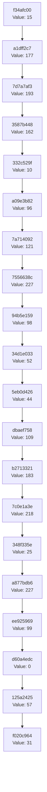

# Hash Chain Visualization

```mermaid
graph TD
    C0["f020c964<br/>Value: 31"]
    C1["125a2425<br/>Value: 57"]
    C1 --> C0
    C2["d60a4edc<br/>Value: 0"]
    C2 --> C1
    C3["ee925969<br/>Value: 99"]
    C3 --> C2
    C4["a877bdb6<br/>Value: 227"]
    C4 --> C3
    C5["348f335e<br/>Value: 25"]
    C5 --> C4
    C6["7c0e1a3e<br/>Value: 218"]
    C6 --> C5
    C7["b2713321<br/>Value: 183"]
    C7 --> C6
    C8["dbaef758<br/>Value: 109"]
    C8 --> C7
    C9["5eb0d426<br/>Value: 44"]
    C9 --> C8
    C10["34d1e033<br/>Value: 52"]
    C10 --> C9
    C11["94b5e159<br/>Value: 98"]
    C11 --> C10
    C12["7556638c<br/>Value: 227"]
    C12 --> C11
    C13["7a714092<br/>Value: 121"]
    C13 --> C12
    C14["a09e3b82<br/>Value: 96"]
    C14 --> C13
    C15["332c529f<br/>Value: 10"]
    C15 --> C14
    C16["3587b448<br/>Value: 162"]
    C16 --> C15
    C17["7d7a7af3<br/>Value: 193"]
    C17 --> C16
    C18["a1dff2c7<br/>Value: 177"]
    C18 --> C17
    C19["f34afc00<br/>Value: 15"]
    C19 --> C18
```