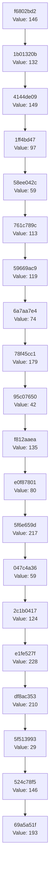

# Hash Chain Visualization

```mermaid
graph TD
    C0["69a5a51f<br/>Value: 193"]
    C1["524c78f5<br/>Value: 146"]
    C1 --> C0
    C2["5f513993<br/>Value: 29"]
    C2 --> C1
    C3["df8ac353<br/>Value: 210"]
    C3 --> C2
    C4["e1fe527f<br/>Value: 228"]
    C4 --> C3
    C5["2c1b0417<br/>Value: 124"]
    C5 --> C4
    C6["047c4a36<br/>Value: 59"]
    C6 --> C5
    C7["5f6e659d<br/>Value: 217"]
    C7 --> C6
    C8["e0f87801<br/>Value: 80"]
    C8 --> C7
    C9["f812aaea<br/>Value: 135"]
    C9 --> C8
    C10["95c07650<br/>Value: 42"]
    C10 --> C9
    C11["78f45cc1<br/>Value: 179"]
    C11 --> C10
    C12["6a7aa7e4<br/>Value: 74"]
    C12 --> C11
    C13["59669ac9<br/>Value: 119"]
    C13 --> C12
    C14["761c789c<br/>Value: 113"]
    C14 --> C13
    C15["58ee042c<br/>Value: 59"]
    C15 --> C14
    C16["1ff4bd47<br/>Value: 97"]
    C16 --> C15
    C17["4144de09<br/>Value: 149"]
    C17 --> C16
    C18["1b01320b<br/>Value: 132"]
    C18 --> C17
    C19["f6802bd2<br/>Value: 146"]
    C19 --> C18
```